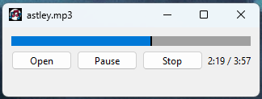

# Wiola Player

A small desktop music player for WAV, FLAC and MP3. One window, three buttons, a seek bar. On
Windows it is a single executable: nothing to install, no DLLs to place beside it.

## Run it on Windows

1. Download
   [`wiola-player.exe`](https://github.com/Wiolus/wiola-player/releases/latest/download/wiola-player.exe)
   from the [latest release](https://github.com/Wiolus/wiola-player/releases/latest).
2. Double-click it.
3. Press **Open** and pick a track.

There is no installer and no setup. Delete the file when you are done with it.

## Run it on Linux

There is no package yet, so it is built from source. [CONTRIBUTING.md](CONTRIBUTING.md) has the
steps.

## Using it

**Open** chooses a track, **Play** starts it and turns into **Pause**, **Stop** returns to the
beginning. The title bar shows the file that is loaded, and the bar above the buttons shows where
you are in it - click it to jump. Elapsed and total time sit to the right.

Tracks are chosen in the window, so there is nothing to type.

## Contributing

[CONTRIBUTING.md](CONTRIBUTING.md) is the one place the build is described, for both platforms,
along with the test suite, coverage, formatting and commit names.

## License

GPL-3.0. See [LICENSE](LICENSE).
